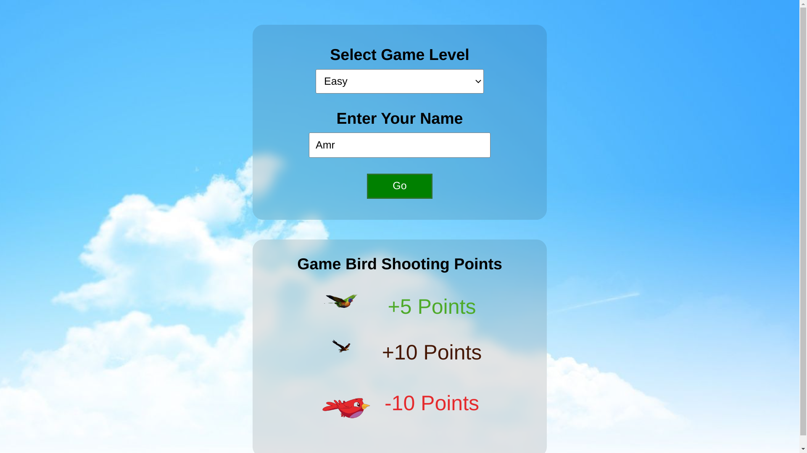
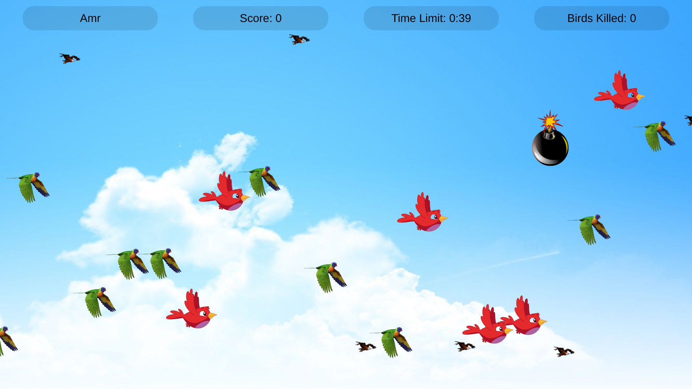
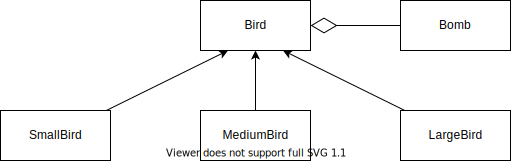
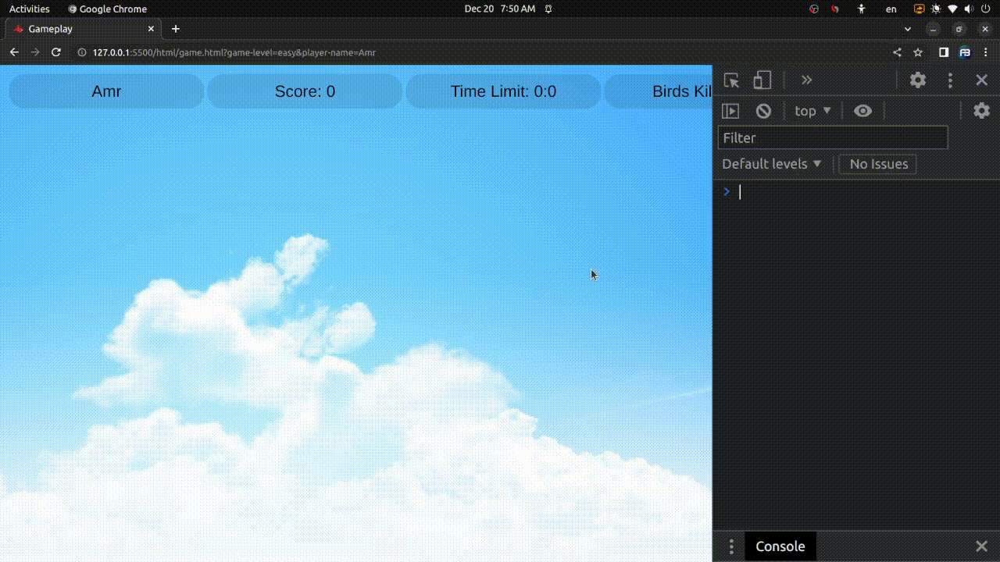
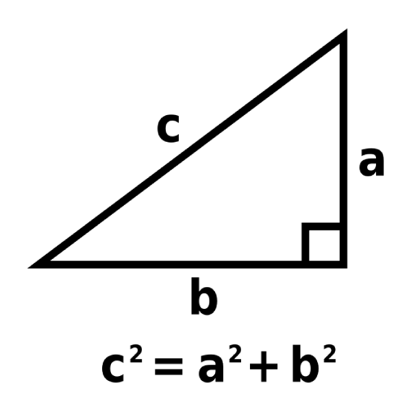
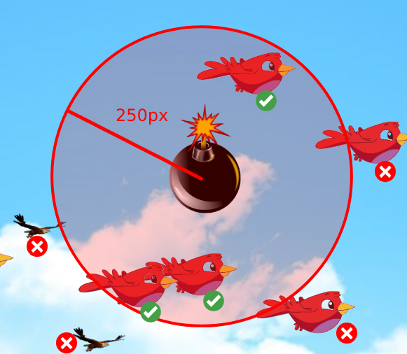
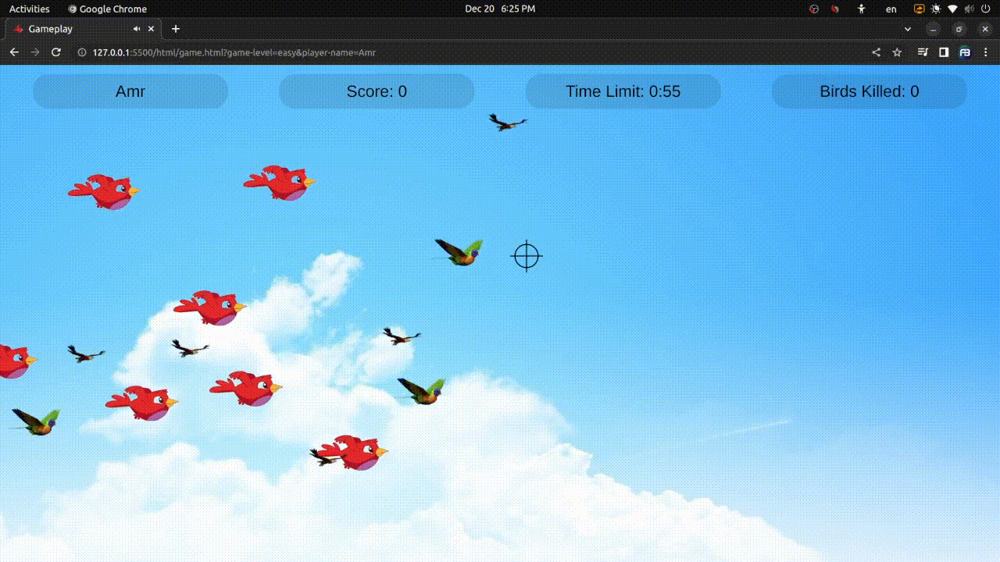

# Shooting Birds Game

**Shooting Birds** is a game which you shoot birds and bombs, you win when you score 50 points or higher.



## Table of Contents  
[Game Rules](#game-rules)  
[Gameplay](#gameplay)  
[OOP Design](#oop-design)  
[Usage of requestAnimationFrame()](#usage-of-requestanimationframe)  
[Bomb influence range](#bomb-influence-range)  
[Object non-linear Falling](#object-non-linear-falling)

## Game Rules

* There are 3 different levels of difficulity:

| **Level** 	| **Movement** 	| **Speed** 	|
|-----------	|--------------	|-----------	|
| Easy      	| Horizontal   	| Slow      	|
| Medium    	| Slope        	| Medium    	|
| Hard      	| Slope        	| Fast      	|

* You must enter your name.
* There are 3 different types of birds, small bird has a greater score and Big bird has negative score

| **Bird type** | **Score**  |
|---------------|------------|
| Small         | +10 Points |
| Medium        | +5 Points  |
| Large         | -10 Points |


## Gameplay

* When game starts, you have 1 minute countdown to shoot birds.
* Score and number of birds killed are calculated and updated whenever you kill a bird.
* A bomb will fall from the top every (5-10) seconds, if the user click on it, surrounding birds
will died and their scores will be calculated.



## OOP Design

* Bird is an abstract class, the three classes (SmallBird, MediumBird and LargeBird) inherit from it.
* Bomb deals with any object created from classes that inherit from Bird class (one to many).

<p align="center" width="100%">
     
</p>

## Usage of requestAnimationFrame()

Using `requestAnimationFrame()` instead of `setInterval()` to animate objects on window gives some advantages:
* `setInterval()` puts some limits and cannot be used for displays with different refresh rates, for example: `setInterval(callback, 1000 / 60)` for 60HZ displays and even though the motion will not be perfect (1000 / 60 = 16.666667 will be rounded to 17).
* `requestAnimationFrame(callback)` executes callback function whenever the frame is refreshed, so the animation will be perfect as every generated frame will be in sync with display.
* Make use of high frame rate devices with refresh rates equals 90HZ, 120HZ, 240HZ and so on.

## Bomb influence range

* First step is to calculate the coordinates of center of the bomb
```
  let bombCG = {
    x: (parseInt(this.#image.style.left) + 0.5 * this.#image.width), 
    y: (parseInt(this.#image.style.top) + 0.5 * this.#image.height)
  }
```



* Then calculate the coordinates of center of each bird
```for (let bird of birdArray) {
  for (let bird of birdArray) {
    let birdCG = {
      x: parseInt(bird.image.style.left) + 0.5 * bird.image.width,
      y: parseInt(bird.image.style.top) + 0.5 * bird.image.height
    }
  }
```

* By using pythagoras theorem, we can obtain the distance between bird and bomb.
  
<p align="center" width="100%">
     
</p>

* c = $\sqrt{a^2 + b^2}$

```
calculateDistance (cg1, cg2) {
  return Math.sqrt(Math.pow((cg2.x - cg1.x), 2) + Math.pow((cg2.y - cg1.y), 2));
}
```

* Finally check whether each bird exist within the bomb influence range by comparing the distance between bird and bomb with 250px.
  
```
if (this.calculateDistance(bombCG, birdCG) < 250) {
  bird.kill();
}
```

<p align="center" width="100%">
     
</p>

## Object non-linear Falling

* Objects fall with accelerated speed to simulate the gravity effect.
* Speed increases each time the screen is refreshed.
  
```
this.#speed *= 1.02;
if (parseInt(this.#image.style.top) < window.innerHeight) {
  this.#image.style.top = `${Math.round(parseFloat(this.#image.style.top) + this.#speed)}px`;
  window.requestAnimationFrame(this.fall.bind(this));
}
```

